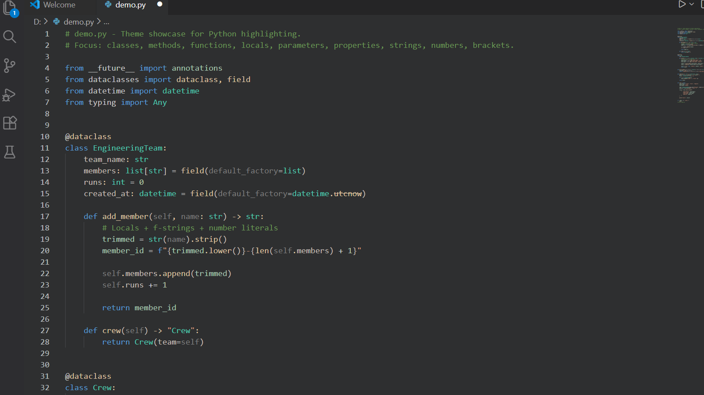
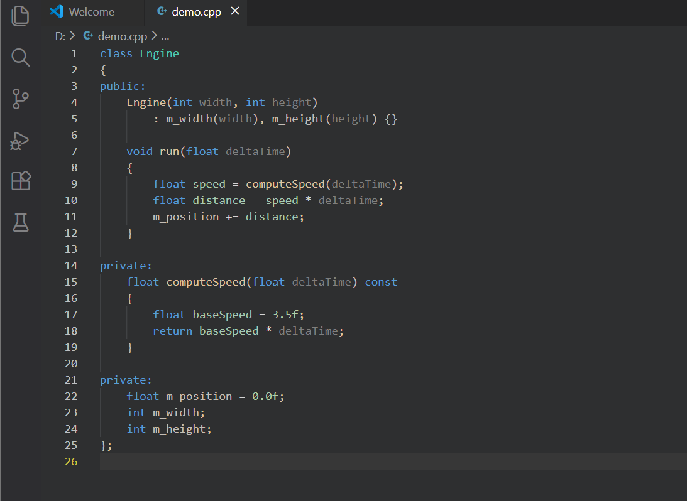
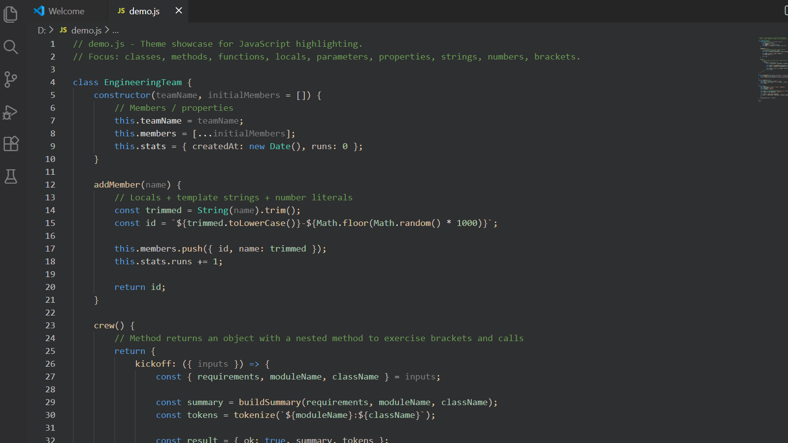
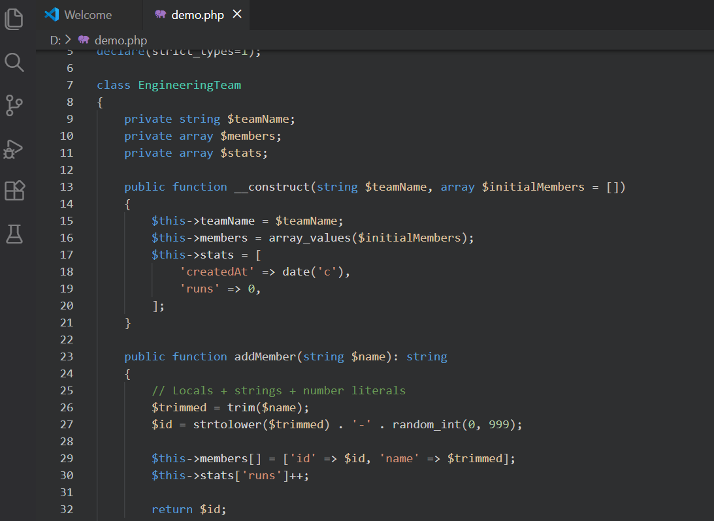

# 🌙 Silvi Midnight Theme

**Silvi Midnight Theme** is a calm, eye-friendly dark theme for VS Code and Cursor, designed for deep focus and long coding sessions.

It blends soft, dark backgrounds with cool blue–cyan accents and carefully balanced highlights for variables, methods, and structures.  
The goal is clarity without noise — a quiet *midnight* atmosphere that stays out of your way and lets you focus entirely on your code.

---

## Preview

### 🐍 Python

### ⚙️ C++

### 🧩 JavaScript

### 🐘 PHP

---

## 🎯 Ideal for

- 🐍 Python, ⚙️ C++, 🧩 JavaScript, 🐘 PHP  
- 📓 Jupyter notebooks and research-oriented workflows  
- 🤖 AI / ML, data engineering, and backend development  
- 🌙 Long night-time coding sessions  
- 🧘 Developers who prefer calm, low-noise themes over neon-heavy styles  

---

## 🎨 Design principles

- 🎛️ Subtle contrast tuned for long focus sessions  
- 🔍 Clear distinction between:
  - local variables
  - parameters
  - members / properties
  - methods and functions  
- 🌐 Consistent appearance across different languages and editors  
- 👁️ No harsh colors, no visual fatigue  

---

## 🚀 Installation

### From Marketplace (recommended)
1. Open **Extensions** in VS Code or Cursor  
2. Search for **Silvi Midnight Theme**  
3. Install and activate via:  
   **Command Palette → Preferences: Color Theme → Silvi Midnight Theme**

### Local install (optional)
1. Package the extension into a `.vsix` file  
2. Install the `.vsix`:
   - **VS Code**: Extensions → `…` → **Install from VSIX…**
   - **Cursor**: Extensions → `…` → **Install from VSIX…**
3. Activate the theme from the Color Theme selector

---

## 📄 Credits / License

This theme includes a modified copy of the **“C/C++ Themes”** base theme from  
`ms-vscode.cpptools-themes`  
Licensed under the MIT License.  
Copyright © Microsoft Corporation.
